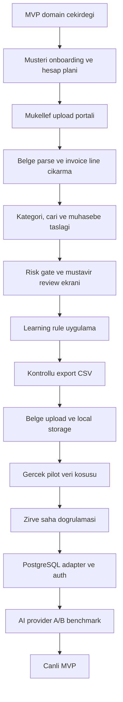

# Fisora Uygulama Yol Haritasi

## Mevcut Durum

Tamamlanan ana dilimler:

- Muhasebe domain cekirdegi: hesap plani importu, fis taslagi, risk bayraklari.
- Business relevance: faaliyet/NACE baglami, marka-model kategori siniflandirma.
- Cari eslestirme: VKN/TCKN, unvan benzerligi, review fallback.
- Review ve learning modeli: mustavir karari, learning event, otomasyon adayi.
- Export gate: sadece guvenli ve dengeli kayitlar export paketine girer.
- MVP portal: belge listesi, review kuyrugu, export hazir gorunumu.
- API scaffold: onboarding, simulation, review, export, store endpointleri.
- Yerel store: `exports/phase0_store.json` ile ignored demo/pilot snapshot.
- AI adapter: statik kural once, AI sadece belirsiz kalemde, JSON schema guard.
- Sentetik pilot: 3 belgeyle uc uca store + review + export CSV kosusu.
- Learning rule uygulama: mustavir duzeltmesi sonraki benzer belgede oneriyi etkiler.
- Portal ilk UI dilimi: mukellef yukleme alani ve mustavir review calisma masasi.
- Belge upload/storage ilk sozlesmesi: metaveri, local storage path, sha256 ve kuyruk durumu.
- Kendi sunucu yonu: GPU'suz baslangic, AI sadece dis API/batch ve maliyet cap'iyle.
- Server deployment plani: Nginx, Docker Compose, frontend, backend, worker, PostgreSQL, Redis, document volume.
- Retention politikasi: ham PDF/XML/ekstre 90 gun saklanir, metadata ve muhasebe izi korunur.
- Production compose iskeleti: backend, frontend, nginx, worker, postgres, redis ve backup servisleri.
- PostgreSQL adapter ilk surumu: JSON workspace kontrati production database'de `workflow_records` ile saklanabilir.
- Worker queue ilk surumu: upload sonrasi processing job olusur, parser tipi secilir, worker workspace'e guvenli review sonucu yazar.
- Portal job durumu: yuklenen belgelerde parser ve job status gorunur.

## Siradaki 5 Adim

1. Gercek parser ciktilarini worker'a baglama
   - Text PDF, e-fatura XML, CSV/XLSX ekstreden alan cikarma worker job sonucuna baglanir.
   - Placeholder review sonucu yerine gercek line item ve tutar bilgisi yazilir.

2. PostgreSQL saha smoke testi
   - `backend/db/schema.sql` gercek Postgres'e uygulanir.
   - `FISORA_STORE_BACKEND=postgres` ile client -> upload -> worker -> workspace akisi denenir.
   - Compose config ve container start senaryosu sunucuda dogrulanir.

3. Portal kararlarini API'ye yazma
   - Musavir review butonlari `store/review-decision` endpointine baglanir.
   - Duzeltme alanlari hesap/cari kodu ve gerekceyle birlikte kalici olur.
   - Karar sonrasi learning event gorunur.

4. Gercek upload iyilestirmesi ve dosya saklama
   - Base64 MVP sozlesmesi buyuk dosyalar icin multipart veya direct-upload modeline tasinir.
   - Ham belge ile turetilmis parse/AI/export ciktisi ayrimi korunur.

5. Banka/POS parse ve matching
   - Ekstre satirlari banka aciklamasi, tutar, tarih ve cari adayiyla review/export gate'e baglanir.
   - Ilk hedef: GIB, SGK, POS bloke, banka tahsilat/odeme taslaklari.

Sonraki saha kilidi: Zirve export formati gercek programda denenmeden "tamam" sayilmaz.

## Genel Kalan Is Haritasi

## Kapanmamis Ana Basliklar

- Auth ve yetki: Serbest uyelik yok; kullanici bastan mukellefe bagli olmali.
- PostgreSQL saha testi: adapter yazildi, gercek Postgres kosusu henuz yapilmadi.
- Dosya saklama: PDF/XML/ekstre ve turetilmis JSON/CSV ayrimi, retention politikasi.
- Banka/POS akisi: UI yukleme alani var; parse ve matching katmani genisleyecek.
- Mustavir calisma masasi: gorunum var; karar yazma API baglantisi genisleyecek.
- Zirve format kesinligi: Gercek import dosyasiyla saha testi sart.
- AI provider secimi: OpenAI/Gemini/Manus kararini pilot batch benchmark belirlemeli.
- Maliyet limiti: Belge basina AI cagrisi, token/karakter limiti ve aylik cap.
- Denetim izi: Kim yukledi, kim onayladi, ne degisti, hangi kurala donustu.
