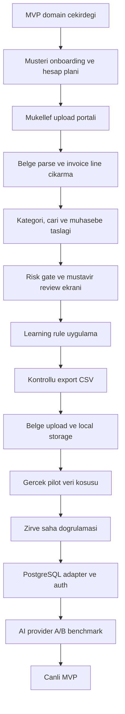

# Fisora Uygulama Yol Haritasi

## Mevcut Durum

Tamamlanan ana dilimler:

- Muhasebe domain cekirdegi: hesap plani importu, fis taslagi, risk bayraklari.
- Business relevance: faaliyet/NACE baglami, marka-model kategori siniflandirma.
- Cari eslestirme: VKN/TCKN, unvan benzerligi, review fallback.
- Review ve learning modeli: mustavir karari, learning event, otomasyon adayi.
- Export gate: sadece guvenli ve dengeli kayitlar export paketine girer.
- MVP portal: belge listesi, review kuyrugu, export hazir gorunumu.
- API scaffold: onboarding, simulation, review, export, store endpointleri.
- Yerel store: `exports/phase0_store.json` ile ignored demo/pilot snapshot.
- AI adapter: statik kural once, AI sadece belirsiz kalemde, JSON schema guard.
- Sentetik pilot: 3 belgeyle uc uca store + review + export CSV kosusu.
- Learning rule uygulama: mustavir duzeltmesi sonraki benzer belgede oneriyi etkiler.
- Portal ilk UI dilimi: mukellef yukleme alani ve mustavir review calisma masasi.
- Belge upload/storage ilk sozlesmesi: metaveri, local storage path, sha256 ve kuyruk durumu.
- Kendi sunucu yonu: GPU'suz baslangic, AI sadece dis API/batch ve maliyet cap'iyle.
- Server deployment plani: Nginx, Docker Compose, frontend, backend, worker, PostgreSQL, Redis, document volume.

## Siradaki 5 Adim

1. Frontend yukleme ekranini upload API'ye baglama
   - Mukellef dosya sectiginde `store/document-upload` endpointine metaveri ve ilk etapta base64 icerik gonderilir.
   - Durum: backend sozlesmesi, ilk frontend baglantisi ve upload sonrasi workspace refresh baslatildi.

2. Portal UI dilimini workspace API'ye baglama
   - Mukellef yukleme, belge listesi, fatura onizleme ve fis taslagi ekranlari mock veriden store/API verisine tasinir.
   - Durum: UI iskeleti baslatildi; workspace okuma baglantisi eksik.

3. Gercek upload iyilestirmesi ve dosya saklama
   - Base64 MVP sozlesmesi buyuk dosyalar icin multipart veya direct-upload modeline tasinir.
   - Ham belge ile turetilmis parse/AI/export ciktisi ayrimi korunur.

4. Banka/POS parse ve matching
   - Ekstre satirlari banka aciklamasi, tutar, tarih ve cari adayiyla review/export gate'e baglanir.
   - Ilk hedef: GIB, SGK, POS bloke, banka tahsilat/odeme taslaklari.

5. Online AI batch benchmark
   - `FISORA_AI_PROVIDER=disabled|openai|gemini|manus` secimi.
   - Ilk entegrasyonda sadece siniflandirma/gerekce uretimi; muhasebe karari yok.
   - Iki pilot mukellefle 20-50 fatura ve 1-2 ekstre uzerinden maliyet/dogruluk olculur.

Sonraki saha kilidi: Zirve export formati gercek programda denenmeden "tamam" sayilmaz.

## Genel Kalan Is Haritasi

## Kapanmamis Ana Basliklar

- Auth ve yetki: Serbest uyelik yok; kullanici bastan mukellefe bagli olmali.
- PostgreSQL adapter: Yerel JSON store yerine production repository.
- Dosya saklama: PDF/XML/ekstre ve turetilmis JSON/CSV ayrimi, retention politikasi.
- Banka/POS akisi: UI yukleme alani var; parse ve matching katmani genisleyecek.
- Mustavir calisma masasi: fatura gorunumu, fis taslagi ve karar paneli API'ye baglanacak.
- Zirve format kesinligi: Gercek import dosyasiyla saha testi sart.
- AI provider secimi: OpenAI/Gemini/Manus kararini pilot batch benchmark belirlemeli.
- Maliyet limiti: Belge basina AI cagrisi, token/karakter limiti ve aylik cap.
- Denetim izi: Kim yukledi, kim onayladi, ne degisti, hangi kurala donustu.
