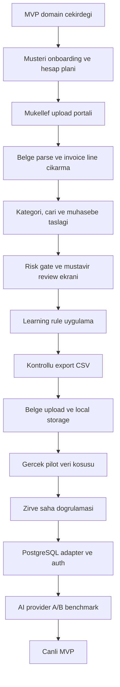

# Fisora Uygulama Yol Haritasi

## Mevcut Durum

Tamamlanan ana dilimler:

- Muhasebe domain cekirdegi: hesap plani importu, fis taslagi, risk bayraklari.
- Business relevance: faaliyet/NACE baglami, marka-model kategori siniflandirma.
- Cari eslestirme: VKN/TCKN, unvan benzerligi, review fallback.
- Review ve learning modeli: mustavir karari, learning event, otomasyon adayi.
- Export gate: sadece guvenli ve dengeli kayitlar export paketine girer.
- MVP portal: belge listesi, review kuyrugu, export hazir gorunumu.
- API scaffold: onboarding, simulation, review, export, store endpointleri.
- Yerel store: `exports/phase0_store.json` ile ignored demo/pilot snapshot.
- AI adapter: statik kural once, AI sadece belirsiz kalemde, JSON schema guard.
- Sentetik pilot: 3 belgeyle uc uca store + review + export CSV kosusu.
- Learning rule uygulama: mustavir duzeltmesi sonraki benzer belgede oneriyi etkiler.
- Portal ilk UI dilimi: mukellef yukleme alani ve mustavir review calisma masasi.
- Belge upload/storage ilk sozlesmesi: metaveri, local storage path, sha256 ve kuyruk durumu.
- Kendi sunucu yonu: GPU'suz baslangic, AI sadece dis API/batch ve maliyet cap'iyle.
- Server deployment plani: Nginx, Docker Compose, frontend, backend, worker, PostgreSQL, Redis, document volume.
- Retention politikasi: ham PDF/XML/ekstre 90 gun saklanir, metadata ve muhasebe izi korunur.
- Production compose iskeleti: backend, frontend, nginx, worker, postgres, redis ve backup servisleri.
- PostgreSQL adapter ilk surumu: JSON workspace kontrati production database'de `workflow_records` ile saklanabilir.
- Worker queue ilk surumu: upload sonrasi processing job olusur, parser tipi secilir, worker workspace'e guvenli review sonucu yazar.
- Portal job durumu: yuklenen belgelerde parser ve job status gorunur.
- Worker parser baglantisi: text PDF ve e-fatura XML sonucunu simulation motoruna baglar.
- Banka/POS parser ilk surumu: CSV/XLSX ekstre satirlarini GIB, SGK, POS ve belirsiz kategoriye ayirir.
- Portal karar API baglantisi: musavir karar butonlari `store/review-decision` ile kalici learning event uretir.
- PostgreSQL smoke test script'i: schema uygulanmis gercek database'de store ve worker akisini dener.
- Multipart upload ilk surumu: portal dosyalari base64 yerine `FormData` ile API'ye gonderir.
- Banka/POS statement fis taslagi: parse edilen satirlardan dengeli banka fis entry payload'i uretir.
- Review duzeltme formlari: mustavir hesap/cari/gerekce duzeltmesini kararla birlikte API'ye yazar.
- Workspace export package: store'daki guvenli ve dengeli fatura/statement entry'lerinden export paketi uretir.
- AI batch benchmark altyapisi: statik kural ve replay provider payload'lari uzerinden kategori dogruluk/maliyet sinyali hesaplar.
- Export CSV dosya uretimi: workspace export package indirilebilir CSV dosyasina yazilir.
- Review duzeltmesini UI taslagina uygulama: girilen hesap/cari kodlari secili fis satirinda aninda gorunur.
- Review duzeltmesini kalici taslaga uygulama: mustavir onayi workspace refresh sonrasi korunur.
- Export indirme izi: CSV indirildiginde `downloaded_at` ve `download_count` saklanir.
- Docker compose saha kontrolu: production compose parse edildi, Postgres/Redis healthy basladi, migration runner ve Postgres smoke testi gecti.
- Portal yetki iskeleti: upload icin mukellef onboarding kaydi ve atanmis portal kullanicisi zorunlu hale geldi.
- Banka/POS cari eslestirme: ekstre satirlari VKN/TCKN/unvan uzerinden 120/320 hesap plani adaylarina baglanabilir.
- Client onboarding paketi: mukellef karti, hesap plani ve portal kullanicilari tek API cagrisiyla hazirlanabilir.
- Mukellef listesi API'si: musavir ekraninin cok-mukellef secimine hazir client listesi saglanir.
- Export manifest dosyasi: CSV ile birlikte audit/icerik manifest JSON'u uretilir ve indirilebilir.
- Versioned migration runner: `backend/db/migrations` altindaki SQL dosyalari checksum ile `schema_migrations` tablosuna islenir.
- Portal cok-mukellef secimi: musavir ekraninda API'deki mukellef listesi secilebilir ve secime gore workspace yenilenir.
- Banka/POS cari eslestirme genislemesi: IBAN ve otomasyon adayi gecmis mustavir kararlari cari eslestirmede kullanilir.
- Mock auth/yetki guard: `X-Fisora-User-Id` header'i ile mukellef, mustavir ve admin rolleri test edilebilir.
- Export adapter ayrimi: universal CSV ve JSON manifest adapter'lari ayrildi; dogrulanmis Zirve formati daha sonra eklenecek.
- Mustavir demo gorusmesi paketi: yarinki gorusme icin demo akisi, istenecek dosyalar ve karar sorulari hazirlandi.
- AI assisted draft karari: gecmis veri olmayan yeni mukellefte AI ilk fis
  taslagini hazirlayabilir, ancak export mustavir onayi veya mustavir/ofis
  politikasi olmadan acilmaz.
- AI assisted draft payload'i: simulation sonucu artik `processing_mode`,
  karar kaynagi, deterministic check listesi ve export gate gerekcesi tasir.
- Review ekran karar ayrimi: AI/kural gerekcesi, deterministic denge ve export
  gate nedeni ayri kartlarla gosterilir.
- Sentetik AI benchmark seti: bos benchmark cagrisi Urban Care, Rexton, pil,
  e-fatura, cloud, elektrik, internet, GIB ve bilinmeyen model case'leriyle
  calisir.
- Docker MCP baglantisi: Docker MCP Catalog Codex global config'e baglandi;
  `docker-docs` profilde aktif. Yerel container/compose yonetimi icin MCP server
  bulunmadigindan bu isler Docker CLI ile surduruluyor.
- Full Docker stack smoke: nginx `http://localhost:8088`, backend, frontend,
  Postgres ve Redis ayaga kalkti; `/health`, frontend ve API summary cevap verdi.
- Worker/export/backup smoke: API'den onboarding ve upload yapildi, worker
  container'i job'i tamamladi, workspace `export_ready` oldu, CSV/manifest
  indirildi ve backup job Postgres dump + belge manifesti uretti.
- Auth stratejisi ilk surumu: `mock_header_optional`, `mock_header_required`
  ve `trusted_header` modlari tanimlandi; production env `trusted_header`
  kararini tasir, backend auth status endpoint'i verir.
- Zirve trial export adapter'i: `zirve_trial_csv` dogrulanmamis saha eslestirme
  adayi olarak eklendi; manifestte validation status ve field mapping notlari
  tasinir.
- Production deploy checklist: TLS, firewall, env secret, worker/export/backup
  smoke ve 90 gun belge retention kontrolu tek runbook'a baglandi.
- Session/auth MVP: parola hash'i, session token hash'i, login/session/logout
  endpointleri ve `X-Fisora-Session` yetki cozumu eklendi.
- Storage adapter ilk surumu: local belge storage adapter arkasina alindi;
  ileride S3-compatible storage ayni kontrata baglanabilir.
- Production readiness endpoint'i: auth modu, storage yazilabilirligi, store
  backend, AI provider ve export adapter durumu `/store/system/readiness` ile
  gorulebilir hale geldi.
- Docker sonrasi mustavirsiz backlog: teknik kalan isler
  `docs/post-docker-non-accountant-backlog.md` altinda ayrildi.
- Frontend session paneli: login, logout, demo sifre atama ve readiness ozeti
  portal ust paneline eklendi; session varsa API istekleri
  `X-Fisora-Session` ile gider.
- Kullanici davet/reset iskeleti: invite token, invite accept, password reset
  token ve reset confirm endpointleri eklendi.
- AI usage ledger: product classification client bazli usage event yazabilir;
  provider, input karakteri, skip nedeni ve tahmini maliyet summary olarak
  izlenebilir.
- Operasyon loglari: upload, review, export, export download, processing run ve
  retention olaylari store'a yazilir; client bazli operation health endpoint'i
  worker/job durumunu ozetler.
- Admin readiness paneli: auth, storage, worker, AI cap, Zirve adapter ve son
  operasyon olayi frontend'de gorunur.
- Private intake manifest araci: mustavirden gelen lokal pilot klasoru hash,
  belge tipi, mukellef, donem ve gizlilik seviyesiyle `private_samples/`
  manifestine donusur.
- Private intake import araci: manifestten hesap plani, fatura/XML ve
  banka/POS dosyalari store/upload job hattina aktarilabilir.
- Backup/disk health: readiness payload'i son backup, backup manifest sayisi,
  belge/export/backup boyutlari ve disk doluluk oranini tasir; admin panelde
  Backup karti gorunur.
- Production ops scriptleri: check, deploy, migrate, smoke, backup-once, logs,
  ps, down ve restore-postgres komutlari `deploy/scripts/fisora-prod.sh`
  altinda toplandi.

## MVP Ilerleme Degerlendirmesi

2026-06-03 itibariyle muhendislik tahmini:

- Genel MVP prototip: %82-85.
- Server kiralama ve mustavir gorusmesi oncesi hazirlik: %90-93.
- Production-ready canli MVP: %63-68.

Bu oranlar gercek Zirve import dogrulamasi, gercek pilot veri kosusu ve
production sunucu kurulumu tamamlanmadan daha yukari sayilmamalidir.

## Siradaki Adimlar

1. S3-compatible object storage hazirligi
   - Local storage adapter yanina object storage sozlesmesi eklenir.
   - 90 gun retention ve download URL stratejisi belirlenir.

2. AI provider hazirligi ikinci dilim
   - OpenAI/Gemini provider adapter taslagi eklenir.
   - Sentetik ve gercek/anonim benchmark ayni komutla kosulabilir hale gelir.
   - Aylik cap asiminda AI cagrisi durdurulur.

3. Upload limit ve guvenlik kontrolleri
   - Dosya boyutu, uzanti ve MIME kontrolleri net hata payload'i uretir.

4. Auth/UI tamamlayici isler
   - Invite/reset akisi admin panelinden daha rahat yonetilir.
   - Production bootstrap kapali durumu UI'da net gorunur.

6. Zirve saha testi ve verified adapter kilidi
   - `zirve_trial_csv` veya mustavirden gelen ornek format Zirve'de denenir.
   - Calisan kolon/format sabitlenince adapter `verified_in_zirve=true` olacak
     sekilde ayrilir.

7. AI assisted draft pilot entegrasyonu
   - Soguk baslangic icin AI taslak modu backend payload'inda acik durum olarak
     tutulur.
   - Review ekraninda AI gerekcesi, deterministic denge ve export gate nedeni
     birlikte gosterilir.
   - Gercek fatura ile test lokal kalir; public demo sentetik veriyle ayrilir.

8. Production hardening saha uygulamasi
   - `docs/production-deploy-checklist.md` gercek sunucuda uygulanir.
   - TLS, firewall, backup hedefi, disk monitor ve env secret kontrolleri
     tamamlanir.

Sonraki saha kilidi: Zirve export formati gercek programda denenmeden "tamam" sayilmaz.

Docker ve mustavir verisi beklemeden yapilabilecek ayrintili demo oncesi is
sirasi icin `docs/pre-demo-execution-plan.md` kullanilir.

## Genel Kalan Is Haritasi

## Kapanmamis Ana Basliklar

- Auth ve yetki: Mock header guard var; gercek login/session provider secilmeli.
- PostgreSQL saha testi: adapter yazildi, Docker daemon izni acilinca gercek Postgres kosusu yapilacak.
- Dosya saklama: PDF/XML/ekstre ve turetilmis JSON/CSV ayrimi, retention politikasi.
- Banka/POS akisi: satir parse, dengeli fis taslagi, VKN/unvan, IBAN ve gecmis karar cari eslestirmesi var.
- Mustavir calisma masasi: karar ve duzeltme API baglantisi var; duzeltme artik kalici taslak ve learning izine uygulanir.
- Zirve format kesinligi: Gercek import dosyasiyla saha testi sart.
- AI provider secimi: OpenAI/Gemini/Manus kararini pilot batch benchmark belirlemeli.
- Maliyet limiti: Belge basina AI cagrisi, token/karakter limiti ve aylik cap.
- Denetim izi: Kim yukledi, kim onayladi, ne degisti, hangi kurala donustu.
