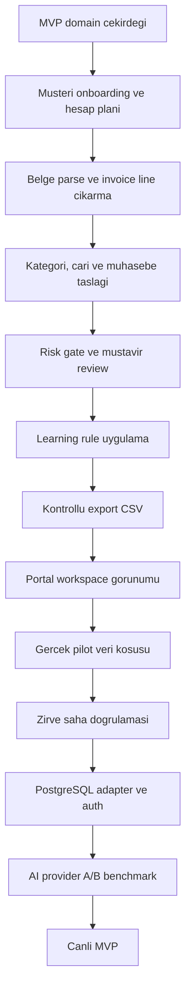

# Fisora Uygulama Yol Haritasi

## Mevcut Durum

Tamamlanan ana dilimler:

- Muhasebe domain cekirdegi: hesap plani importu, fis taslagi, risk bayraklari.
- Business relevance: faaliyet/NACE baglami, marka-model kategori siniflandirma.
- Cari eslestirme: VKN/TCKN, unvan benzerligi, review fallback.
- Review ve learning modeli: mustavir karari, learning event, otomasyon adayi.
- Export gate: sadece guvenli ve dengeli kayitlar export paketine girer.
- MVP portal: belge listesi, review kuyrugu, export hazir gorunumu.
- API scaffold: onboarding, simulation, review, export, store endpointleri.
- Yerel store: `exports/phase0_store.json` ile ignored demo/pilot snapshot.
- AI adapter: statik kural once, AI sadece belirsiz kalemde, JSON schema guard.
- Sentetik pilot: 3 belgeyle uc uca store + review + export CSV kosusu.

## Siradaki 5 Adim

1. Learning rule uygulama
   - Mustavir duzeltmesi sonraki benzer belgede hesap/cari onerisine yansir.
   - Durum: baslatildi.

2. Workspace formatina portal uyumu
   - Portal `local-review-data.json` disinda store/workspace snapshot formatini da okuyabilir.
   - Amac: pilot runner ciktisini UI'da direkt gostermek.

3. Gercek AI provider adapter
   - `FISORA_AI_PROVIDER=disabled|openai|gemini|manus` secimi.
   - Ilk entegrasyonda sadece siniflandirma/gerekce uretimi; muhasebe karari yok.

4. Pilot veri kosusu
   - Iki mukellef: hesap plani, 20-50 fatura, 1-2 ekstre.
   - Ozel belgeler `private_samples/` ve ignored store/export dosyalarinda kalir.

5. Zirve export saha dogrulamasi
   - En az bir export formati gercek Zirve import testinden gecer.
   - Basarisiz kolon/format farklari validation matrix'e islenir.

## Genel Kalan Is Haritasi

## Kapanmamis Ana Basliklar

- Auth ve yetki: Serbest uyelik yok; kullanici bastan mukellefe bagli olmali.
- PostgreSQL adapter: Yerel JSON store yerine production repository.
- Dosya saklama: PDF/XML ve turetilmis JSON/CSV ayrimi, retention politikasi.
- Banka/POS akisi: Su an fatura agirlikli; ekstre matching katmani genisleyecek.
- Zirve format kesinligi: Gercek import dosyasiyla saha testi sart.
- AI provider secimi: OpenAI/Gemini/Manus kararini pilot benchmark belirlemeli.
- Maliyet limiti: Belge basina AI cagrisi, token/karakter limiti ve aylik cap.
- Denetim izi: Kim yukledi, kim onayladi, ne degisti, hangi kurala donustu.

