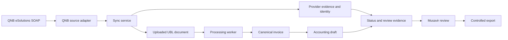

# QNB e-Belge Uctan Uca Entegrasyon Plani

**Goal:** QNB eSolutions uzerinden gelen e-Faturalari guvenli ve tekrar
calistirilabilir bicimde Fisora'ya almak; QNB kaynak kanitini canonical fatura,
muhasebe fisi taslagi, musavir kontrolu ve kontrollu export akisina baglamak;
ardindan status mutabakati ve otomatik senkronizasyonla kapali pilotu
isletilebilir hale getirmek.

**Plan tarihi:** 2026-07-10

**Plan durumu:** Uygulamaya hazir. Faz 1 cekirdegi uygulanmis durumdadir;
siradaki is gercek QNB test belgesiyle uctan uca kanit uretmektir.

**Ilgili belgeler:**

- `docs/superpowers/specs/2026-07-08-qnb-incoming-efatura-design.md`
- `docs/superpowers/specs/2026-07-08-qnb-real-method-mapping.md`
- `docs/current-handoff.md`
- `docs/production-ops-runbook.md`
- `docs/production-deploy-checklist.md`

---

## 1. Baslangic Gercegi

### Tamamlanan cekirdek

- [x] QNB `userService` ve `connectorService` WSDL ayrimi dogrulandi.
- [x] `wsLogin` SOAP cagrisi gercek TEST2 ortaminda basarili oldu.
- [x] `gelenBelgeleriListeleExt` gercek TEST2 ortaminda calisti.
- [x] `gelenBelgeleriIndirExt` adapter ve base64/ZIP/UBL acma kodu yazildi.
- [x] Fake adapter ile deterministik backend testleri yazildi.
- [x] Mulkellef bazli baglanti kaydetme ve baglanti testi eklendi.
- [x] Portalda baglanti, durum yenileme ve tarih aralikli manuel sync eklendi.
- [x] ETTN tabanli duplicate engeli, QNB metadata'si ve pipeline event'leri
  eklendi.
- [x] Indirilen UBL'nin mevcut `uploaded_document` ve `processing_job` akisina
  girmesi saglandi.
- [x] Gercek SOAP adapter `FISORA_QNB_ADAPTER=soap` bayragi arkasina alindi;
  yerel testlerin varsayilani fake adapter olarak korundu.

### Henuz kanitlanmayan kisim

Son gercek sandbox smoke'unda login ve listeleme basarili oldu ancak test gelen
kutusu bos oldugu icin `listed_count = 0` dondu. Bu nedenle su zincir gercek QNB
belgesiyle henuz kanitlanmadi:

```text
QNB test faturasi
  -> gelen belge listesi
  -> UBL indirme
  -> Fisora document store
  -> canonical invoice
  -> muhasebe fisi taslagi
  -> musavir review
  -> kontrollu export sonucu
```

### Mevcut teknik aciklar

- [ ] Gercek test faturasi indirme ve parser/draft sonucu.
- [ ] 100 belge sinirini asan sayfalama.
- [ ] Kalici, mukellef bazli `belgeSiraNo` cursor'u.
- [ ] Status/iptal/red/kabul mutabakati.
- [ ] Planli otomatik sync, lease, retry, backoff ve rate limiting.
- [ ] Credential degerlerinin sifreli veya harici secret store'da saklanmasi.
- [ ] Sync saglik ve hata gorunurlugu.
- [ ] PDF kaniti/onizlemesi.
- [ ] e-Arsiv kaynagi.
- [ ] Giden e-Fatura ve Fisora'dan fatura kesme.

---

## 2. Bu Planin Baglayici Urun Kararlari

1. **QNB bir belge kaynagi ve resmi durum kaniti katmanidir.** Muhasebe hesabi
   secmez; canonical yorum, fis taslagi, review ve export Fisora'nin
   sorumlulugundadir.
2. **Ilk ticari kapsam gelen e-Fatura + durum mutabakatidir.** Giden belge ve
   Fisora'dan fatura kesme bu cekirdegin icine karistirilmayacaktir.
3. **Credential sahipligi mukellef baglantisi bazindadir.** Musavir ofisi
   baglantiyi yonetebilir ama bir mukellefin WS hesabi digerinde kullanilamaz.
4. **ERP kodu platform ayaridir.** QNB'nin Fisora'ya verdigi sabit ERP kodu
   mukellef formunda serbestce degistirilen bir is verisi gibi ele alinmaz;
   secret/config kaynagindan adapter'a verilir.
5. **Portal ve WS kullanicisi ayrilacaktir.** Tekrarlanan otomatik cagrilar
   icin QNB'nin tavsiye ettigi ayri WS kullanicisi kullanilir.
6. **Pilotta indirilen UBL kalici kanit olarak saklanir.** ETTN, hash,
   canonical sonuc, status snapshot ve review/export izi birlikte korunur.
   PDF eklendiginde ayni kanit politikasina girer.
7. **Manuel upload kaldirilmaz.** QNB disi kaynaklar, gecmis belgeler, banka
   ekstreleri, makbuzlar ve entegrator kesintileri icin yedek kaynak olarak
   kalir.
8. **Status degisikligi muhasebe kaydini sessizce silmez veya ters cevirmez.**
   Yeni kanit kaydedilir ve musavire duzeltme karari actirilir.
9. **Tarih aralikli backfill ile cursor sync ayri modlardir.** QNB'nin birlikte
   kabul etmedigi filtreler ayni istekte kullanilmaz.
10. **Sunucu gelistirme on kosulu degildir.** Faz 1-5 yerel ortamda
    gelistirilip sandbox ile kanitlanabilir. Surekli acik scheduler ve gercek
    pilot icin Faz 6 sonunda sunucu gerekir.

---

## 3. Hedef Mimari ve Sorumluluk Sinirlari



### QNB adapter sorumlulugu

- Login/session yonetimi.
- Gelen belge listeleme.
- UBL/PDF indirme.
- Belge status sorgulama.
- QNB hata kodunu guvenli dahili hata sinifina cevirme.
- Timeout, retry sinyali ve rate-limit uyumu.

### Sync service sorumlulugu

- Mukellef/baglanti izolasyonu.
- Backfill ve cursor modunu ayirma.
- Sayfalama ve cursor ilerletme.
- Duplicate/idempotency kontrolu.
- Belge ve provider kanitini kaydetme.
- Processing job kuyruga alma.
- Sync run ozeti ve operasyon olaylari.

### Muhasebe pipeline sorumlulugu

- UBL canonical line extraction.
- Belge yonu ve taraf kimligi.
- KDV ve toplam kontrolleri.
- Cari/hesap adayi ve fis taslagi.
- Risk, review ve export kapilari.

---

## 4. Kalici Veri Sozlesmesi

### `qnb_connection`

```text
connection_id
office_id
client_id
provider = qnb_esolutions
environment
base_url
masked_username
credential_ref
vkn_tckn
status
last_tested_at
last_success_at
last_failure_code
last_failure_at
enabled
created_at
updated_at
```

Kurallar:

- Parola frontend'e geri donmez.
- Parola document metadata, event veya hata detayina yazilmaz.
- `credential_ref`, sifrelenmis deger veya harici secret kaynagina referanstir.
- ERP kodu platform config'inden gelir; client payload'inin guvenilir kaynagi
  degildir.

### `qnb_sync_policy`

```text
client_id
connection_id
enabled
mode = cursor
start_from_date
frequency_minutes
preferred_time
last_qnb_sequence_no
last_success_at
last_attempt_at
next_run_at
max_documents_per_run
lease_owner
lease_expires_at
consecutive_failure_count
```

### `qnb_sync_run`

```text
sync_run_id
client_id
connection_id
mode = backfill | cursor | status
requested_start_date
requested_end_date
cursor_before
cursor_after
listed_count
downloaded_count
duplicate_count
status_updated_count
failed_count
started_at
finished_at
status
safe_error_codes
```

### QNB belge kaniti

Her QNB belgesinde asgari olarak:

```text
source_provider = qnb_esolutions
source_direction
source_external_uuid
source_invoice_no
source_qnb_sequence_no
source_issue_date
source_supplier_tax_id
source_payable_total
source_sync_run_id
source_content_sha256
source_qnb_status
source_pulled_at
source_status_checked_at
```

tutulur. Provider kaniti canonical invoice'in yerine gecmez; ikisi baglantili
ama ayri kayitlardir.

---

## 5. Uygulama Fazlari

## Faz 0 - Mevcut Phase 1 Cekirdeginin Baz Cizgisi

**Durum:** Tamamlandi.

**Mevcut ana dosyalar:**

- `backend/app/domain/qnb_efatura.py`
- `backend/app/domain/qnb_sandbox_outgoing.py`
- `backend/app/api/phase0_routes_qnb.py`
- `backend/app/api/phase0_schemas.py`
- `backend/app/persistence/workflow_store.py`
- `backend/app/persistence/postgres_workflow_store.py`
- `backend/tests/test_qnb_integration.py`
- `backend/scripts/run_qnb_sandbox_smoke.py`
- `backend/scripts/send_qnb_sandbox_invoice.py`
- `backend/tests/test_qnb_sandbox_smoke.py`
- `backend/tests/test_qnb_sandbox_outgoing.py`
- `frontend/app/features/qnb/use-qnb-commands.ts`
- `frontend/app/portal-settings-view.tsx`
- `frontend/app/upload-api.js`
- `frontend/app/upload-api.test.cjs`

**Baz dogrulama:**

```powershell
python -m unittest backend.tests.test_qnb_integration
python -m unittest discover -s backend/tests
node --test frontend/app/*.test.cjs
Push-Location frontend; npm.cmd run build; Pop-Location
git diff --check
```

---

## Faz 1 - Gercek Sandbox Belgesiyle Uctan Uca Kanit

**Amac:** Bos liste smoke'unu gercek belge indirme ve muhasebe taslagina
donusturme kanitina cevirmek.

### Task 1.1 - Test rolleri ve guvenli yerel ortam

- [x] QNB portalindan TEST1/TEST2 hesaplarinin hangisinin gonderen, hangisinin
  alan olacagini dogrula; ayni hesaptan ayni hesaba belge gonderme.
- [ ] Portal kullanicisi yerine ayri WS kullanicisi varsa onu kullan.
- [x] Secret'lari ignored yerel env veya isletim sistemi secret kaynaginda
  tut; dokumana, terminal ozetine ve commit'e yazma.
- [x] `FISORA_QNB_ADAPTER=soap` ile yerel backend'i gercek adapter modunda ac.
- [x] Secilen alici baglantisinda login ve bos/gelecek tarihli connector
  cagrisi ile session devamligini kanitla.

### Task 1.2 - Kontrollu test faturasi

- [x] QNB'nin guncel `belgeGonderExt` ve `gidenBelgeDurumSorgulaExt` SOAP
  kontratlarini gercek WSDL/XSD ve resmi API teknik sayfasindan dogrula.
- [x] TEST2 -> TEST1 icin tek satirli UBL-TR uretebilen, gercek gonderimi
  `--confirm-send` bayragi olmadan yapmayan sandbox gonderim aracini ekle.
- [x] QNB `belgeGonderExt` SOAP metodu ile karsi hesaba basit ama muhasebe
  acisindan okunabilir bir test e-Faturasi gonder.
- [x] Faturada tek satir, acik urun/hizmet aciklamasi, KDV, net, vergi ve genel
  toplam bulunsun.
- [x] QNB OID/status cevabinda ETTN, belge no, gonderim ve alici bilgisini not
  et; parola
  veya session bilgisi kaydetme.

### Task 1.3 - Gercek download ve pipeline

- [x] Manuel tarih aralikli sync ile belgenin listelendigini kanitla.
- [x] `gelenBelgeleriIndirExt` cevabinin ZIP/base64 yapisini ve XML dosya
  sayisini kaydet.
- [x] UBL'nin `einvoice_xml` olarak tek kez saklandigini dogrula.
- [x] `uploaded_document`, `processing_job`, `qnb_ubl_stored` ve
  `qnb_processing_queued` kayitlarini dogrula.
- [x] Worker'i calistir ve canonical satirlar, taraflar, tarih, doviz, KDV ve
  toplamlarin UBL ile ayni oldugunu kontrol et.
- [x] Muhasebe fisi taslagi, review nedeni ve export kapisini incele.
- [x] Ayni pencereyi tekrar sync et; ikinci document/job olusmadigini kanitla.

### Task 1.4 - Kanit artefakti

- [x] Ignored `.env.qnb.local` dosyasini okuyup secret icermeyen JSON ozeti
  veren `backend/scripts/run_qnb_sandbox_smoke.py` aracini ve unit testlerini
  ekle.
- [x] Secret icermeyen bir sandbox smoke ozeti olustur.
- [ ] ETTN'yi tam yazmak gerekmiyorsa maskele; sync run, belge ref, hash,
  canonical sonuc ve duplicate sonucu yeterli olsun.
- [x] Gercek payload mevcut adapter varsayimindan farkliysa once mapping
  dokumanini, sonra adapter ve regression testini guncelle.

**Faz 1 cikis kapisi:** En az bir gercek QNB test UBL'si indirildi, canonical
satirlari okundu, fis taslagi uretildi ve tekrar sync'te duplicate olusmadi.

**Faz 1 sonucu (2026-07-10): Basarili.** TEST2 -> TEST1 `belgeGonderExt`
gonderimi QNB tarafinda durum `3 / processed` oldu. Belge TEST1'de listelendi,
indirildi ve worker tarafindan canonical tek satira cevrildi. 100 TRY matrah,
20 TRY KDV ve 120 TRY odeme toplami dengeli fis taslagi uretti. Ikinci sync
ayni ETTN'yi duplicate olarak atladi. QNB'nin indirilen UBL uzerinde isleme
yaptigi, gonderilen ve indirilen XML SHA-256 degerlerinin farkli olmasindan da
goruldu; Fisora gelen QNB kopyasinin hash'ini resmi kaynak kaniti olarak tuttu.

---

## Faz 2 - Gelen e-Fatura Sync Hardening

**Amac:** Tek cagrilik manuel sync'i guvenilir backfill ve cursor motoruna
donusturmek.

### Task 2.1 - Adapter kontratini genislet

**Dosyalar:**

- Modify `backend/app/domain/qnb_efatura.py`
- Test `backend/tests/test_qnb_integration.py`

- [x] Liste cevabinda `belgeSiraNo` zorunlu-normalize edilen alan olsun.
- [x] Tek sayfa sonucunu `items`, `last_sequence_no`, `has_more` benzeri dahili
  sonuc modeline cevir.
- [x] QNB'nin en fazla 100 belge davranisini fixture ile test et.
- [x] Manuel tarih araligi parametreleri ile cursor parametrelerinin ayni
  request'te birlesmedigini test et.
- [x] Login session'i sync boyunca koru ve destekleniyorsa `logout` ile kapat.
- [x] SOAP fault, auth, timeout, gecici provider hatasi ve kalici payload
  hatasini ayri guvenli kodlara cevir.

### Task 2.2 - Sayfalama ve cursor

**Dosyalar:**

- Modify `backend/app/domain/qnb_efatura.py`
- Modify `backend/app/persistence/workflow_store.py`
- Modify `backend/app/persistence/postgres_workflow_store.py`
- Test `backend/tests/test_qnb_integration.py`
- Test ilgili workflow store testleri

- [x] Backfill modunda QNB'nin tarih+cursor yasagini koru; tarih sonucu 100
  belge sinirina dayanirsa tamamlandi demek yerine `backfill_truncated` ve
  `partial_failed` donerek pencerenin daraltilmasini zorunlu kil.
- [x] Cursor modunda son kalici `belgeSiraNo` sonrasini sorgula.
- [x] Cursor'u yalniz sayfa guvenli bicimde ele alindiktan sonra ilerlet.
- [x] Bir belge indirilemezse diger belgeleri izle ama run'i `partial_failed`
  olarak kaydet; cursor politikasinin belgeyi sonsuza kadar atlamamasini sagla.
- [x] Cursor ve duplicate kontrolunu mukellef + baglanti kapsaminda tut.
- [x] Eszamanli ayni ETTN kaydina karsi kalici unique/idempotency davranisi
  ekle.

### Task 2.3 - Retry, rate limit ve boyut sinirlari

- [x] QNB'nin dakikada 180 request limitinin altinda konservatif adapter
  throttling uygula.
- [x] Timeout, 429/limit ve gecici 5xx hatalarinda sinirli exponential backoff
  uygula.
- [x] Auth ve gecersiz request hatalarini otomatik tekrar etme.
- [x] Run basina belge ve sayfa limiti koy; kalan isi sonraki run'a birak.
- [x] ZIP/XML boyutu ve dosya sayisi icin guvenlik siniri koy.
- [x] ZIP path traversal ve XML parser guvenligini regression testleriyle
  koru.

**Faz 2 cikis kapisi:** 100'den fazla fixture belgesi sayfalanabiliyor;
cursor/retry/duplicate davranisi testli; backfill ve cursor request'leri QNB
parametre kurallarini ihlal etmiyor.

**Faz 2 sonucu (2026-07-11): Basarili.** `QnbIncomingInvoicePage` kontrati,
100 belge provider siniri, cok sayfali cursor sync, JSON/Postgres kalici cursor
ve atomik QNB identity claim eklendi. Bir sayfada hata olursa cursor ilerlemiyor
ve basarisiz identity serbest birakilarak sonraki run'da tekrar denenebiliyor.
Gercek TEST1 smoke'unda kayitli cursor `1` ile iki ardisik run sifir yeni belge
dondu ve cursor `1` olarak korundu. Adapter 150 request/dakika konservatif
throttle, timeout/429/5xx backoff, max sayfa, base64/ZIP boyut-dosya sayisi,
path traversal ve tek XML kontrolleriyle sertlestirildi; session run sonunda
QNB `logout` ile kapatildi.

---

## Faz 3 - Status, Iptal, Red ve Kabul Kaniti

**Amac:** Belge varligini belgenin guncel resmi durumu ile karistirmamak.

### Task 3.1 - Gercek method/payload spike

- [x] Guncel `connectorService?wsdl`, `?wsdl=1` ve resmi API dokumanini tekrar oku.
- [x] `gelenBelgeDurumSorgulaExt` veya QNB'nin guncel olarak onerdiği status
  metodunun tam namespace/request/response kontratini dogrula.
- [x] Islenmis giden e-Fatura sandbox payload'i al (`durum=3`, `processed`).
- [x] Ham QNB degerlerini normalize edilmis Fisora status'lerine esle:
  `received`, `accepted`, `rejected`, `cancelled`, `unknown`.
- [x] Bilinmeyen degeri basarili sayma; `unknown` + warning evidence yap.

### Task 3.2 - Status domain ve persistence

**Dosyalar:**

- Modify `backend/app/domain/qnb_efatura.py`
- Modify `backend/app/persistence/workflow_store.py`
- Modify `backend/app/persistence/postgres_workflow_store.py`
- Modify `backend/app/api/phase0_schemas.py`
- Modify `backend/app/api/phase0_routes_qnb.py`
- Test `backend/tests/test_qnb_integration.py`

- [x] `QnbOutgoingInvoiceStatus` ve adapter status kontratini urun servisine bagla.
- [x] Her sorguda append-only status snapshot/evidence kaydet.
- [x] Onceki ve yeni status farkini belirle.
- [x] Taslak oncesi iptal/red belgesini otomasyondan tut.
- [x] Onaysiz taslakta status review flag'i olustur.
- [x] Onaylanmis veya export edilmis kaydi otomatik silme/ters cevirme;
  musavir duzeltme karari ac.
- [x] Manuel tek belge ve toplu status yenileme endpoint'i ekle.

### Task 3.3 - Musavir gorunurlugu

- [x] Belge ekraninda son QNB durumu ve son sorgulama zamanini kisa ozetle
  goster.
- [x] Status degisimini karar gecmisi icinde goster.
- [x] Iptal/red uyarilarini teknik SOAP ayrintisi olmadan anlat.
- [x] Bilinmeyen/provider hata durumunu gercek iptal gibi sunma.

### Faz 3 uygulama notu - 2026-07-11

Resmi QNB dokumani giden e-Fatura icin `gidenBelgeDurumSorgulaExt` hattini
koruyor. TEST2 -> TEST1 kontrollu faturasi `durum=3`, ETTN ve OID ile
`processed` dondu. Fisora her sorguyu `qnb_outgoing_status_snapshot` olarak
append-only sakliyor, son durumu ayri kayitta tutuyor ve degisimi onceki
durumla karsilastiriyor. Tekli ve toplu endpointler eklendi. Bu katman
muhasebe taslagini, onayi veya export kaydini otomatik silmiyor/ters cevirmiyor.

QNB'nin giden belge isleme kodlari (`1/2/3`) kabul/red/iptal ticari cevabiyla
ayni sey degildir. Bu nedenle iptal/red otomasyon tutma ve belge ekrani
gorunurlugu, gercek QNB ticari cevap payload'i elde edilene kadar acik kalir;
bilinmeyen kod `unknown + warning` olarak korunur.

Gelen belge status kontrati da TEST1 WSDL/XSD uzerinden dogrulandi.
`gelenBelgeDurumSorgulaExt` ETTN ile cagriliyor; resmi `yanitDurumu`
degerleri `-1/0 -> received`, `1 -> rejected`, `2 -> accepted` olarak
normalize ediliyor. `iptalTarihi` varsa durum `cancelled` olur. Gercek TEST1
kanitinda ETTN `9FCD32F8-CC34-4305-B203-0887B8A60773` icin `-1/received`
dondu. Red, iptal ve unknown durumlari belgeyi otomasyonda tutar, review flag
ve pipeline gecmisi olusturur; belge paneli kisa durum/kontrol zamani gosterir.

**Faz 3 cikis kapisi:** Gercek sandbox status cevabi normalize ediliyor;
status degisikligi kanit olarak saklaniyor; onayli/export edilmis muhasebe
kaydi sessizce degismiyor.

---

## Faz 4 - Credential ve Cok Mulkellefli Guvenlik

**Amac:** Yerel spike credential saklama modelini kapali pilot icin guvenli
hale getirmek.

### Task 4.1 - Secret saklama

- [x] Mevcut store'da ham parola saklanan yolu kaldir.
- [x] Ilk pilot icin uygulama anahtariyla authenticated encryption veya
  uygun bir secret store sec; anahtari repo/store disinda tut.
- [x] API response, workspace summary, event, exception ve loglarda secret
  sizintisi testleri ekle.
- [x] Parola degistirmeden connection metadata guncelleme davranisini tanimla.
- [x] Credential rotate/test/disable akisini ekle.

### Task 4.2 - Yetki ve tenant izolasyonu

- [x] Yalniz yetkili musavir/ofis admininin mukellef QNB baglantisini
  yonetebildigini test et.
- [x] Mulkellef A kullanicisinin Mulkellef B connection, status, run veya
  belge kanitini okuyamadigini API testleriyle kanitla.
- [x] Office/client/connection kimliklerinin persistence sorgularinda birlikte
  scope edildigini kontrol et.
- [x] Audit event'lerinde islemi yapan kullanici ve hedef client bulunsun;
  credential bulunmasin.

### Task 4.3 - Config siniri

- [x] ERP kodunu platform config'e tasi ve frontend'de serbest duzenlenen alan
  olmaktan cikar.
- [x] Test ve production endpoint allowlist/validation kurali ekle.
- [x] Production credential ile test endpoint veya tersi eslesmeyi engelleyen
  ortam etiketi ekle.

**Faz 4 cikis kapisi:** Ham parola store/frontend/loglarda yok; tenant
izolasyonu negatif testlerle kanitli; ERP kodu platform config'inden geliyor.

### Faz 4 uygulama notu - 2026-07-11

QNB credential Fernet authenticated encryption ile saklanir. Production
anahtari `FISORA_QNB_CREDENTIAL_KEY` uzerinden ignored server env'den gelir;
yerel gelistirmede ignored `exports/.qnb-credential.key` kullanilir. Store
ham `password` alanini yazmadan once sifreler ve kayittan siler. Bos parola
mevcut ciphertext'i korur; yeni parola rotate + connection test yapar.
Disable endpoint'i ve audit actor/target kaniti eklendi. ERP kodu
`FISORA_QNB_ERP_CODE` platform config'idir ve frontend alanindan kaldirildi.
HTTPS QNB domain allowlist'i ile test/production ortam eslesmesi zorunludur.

---

## Faz 5 - Otomatik Scheduler ve Operasyon Dayanikliligi

**Amac:** Manuel butonu, bilgisayar kapaliyken de calisan guvenilir periyodik
senkronizasyona donusturmek.

### Task 5.1 - Sync policy API

**Dosyalar:**

- Modify `backend/app/api/phase0_schemas.py`
- Modify `backend/app/api/phase0_routes_qnb.py`
- Modify QNB domain/persistence dosyalari
- Modify `frontend/app/upload-api.js`
- Modify `frontend/app/features/qnb/use-qnb-commands.ts`
- Modify `frontend/app/portal-settings-view.tsx`
- Test backend ve frontend QNB testleri

- [ ] Mulkellef bazli enabled, baslangic tarihi, siklik ve run limiti kaydet.
- [ ] Ilk otomatik run'dan once baglanti `active` ve credential erisilebilir
  olmali.
- [ ] Manuel backfill otomatik cursor'u geriye cekmemeli.
- [ ] Policy disable islemi mevcut belge/status kanitini silmemeli.

### Task 5.2 - Due-run claim ve lease

- [ ] Worker'in zamani gelen QNB policy'lerini atomik claim etmesini sagla.
- [ ] Ayni policy'nin iki worker tarafindan ayni anda calismasini lease ile
  engelle.
- [ ] Worker cokerse lease expiry sonrasi yeniden alinabilsin.
- [ ] Basarisiz run icin `next_run_at` backoff uygula; sonsuz hizli retry yapma.
- [ ] Bir mukellefin hatasi diger mukelleflerin sync'ini durdurmasin.

### Task 5.3 - Status reconciliation takvimi

- [ ] Yeni belgelerde ilk status kontrolunu yakin zamanda yap.
- [ ] Eski belgelerde sorgu sikligini azalt.
- [ ] Onaylanmis/export edilmis belgelerde risk penceresine gore periyodik
  kontrol politikasini dokumante et.
- [ ] Provider rate limit butcesini belge listeleme, indirme ve status
  sorgulari arasinda paylastir.

**Faz 5 cikis kapisi:** Yerel Docker stack'te scheduler birden fazla policy'yi
claim ediyor; duplicate run olusmuyor; cursor, retry ve status isi yeniden
baslatmalarda korunuyor.

---

## Faz 6 - Operasyon ve Musavir UX'i

**Amac:** Sistemin ne yaptigini ve neden durdugunu teknik log okumadan
anlasilir hale getirmek.

### Task 6.1 - Baglanti karti

- [ ] Durum: aktif, kimlik dogrulama hatasi, baglanti hatasi, devre disi.
- [ ] Maskeli WS kullanicisi ve ortam.
- [ ] Son basarili baglanti testi.
- [ ] Credential yenile/test et/devre disi birak aksiyonlari.
- [ ] ERP kodunu kullanici girdisi olarak gostermek yerine salt-okunur
  platform bilgisi veya tamamen gizli config yap.

### Task 6.2 - Sync saglik ozeti

- [ ] Son basarili sync ve son deneme.
- [ ] Listelenen, indirilen, duplicate, status guncellenen, hatali sayilari.
- [ ] Cursor ve bekleyen sonraki calisma.
- [ ] Guvenli, eyleme donuk hata aciklamasi.
- [ ] Tarih aralikli manuel backfill aksiyonu.

### Task 6.3 - Belge ve review UX'i

- [ ] Kaynak: QNB eSolutions.
- [ ] Cekilme zamani ve son status kontrolu.
- [ ] Guncel resmi durum ve status degisikligi uyarisi.
- [ ] Canonical veri yetersizse acik `insufficient evidence` mesaji.
- [ ] QNB/engine/AI teknik ayrimini one cikarmadan sistemin ne anladigini
  musavir dilinde goster.

**Faz 6 cikis kapisi:** Musavir bir baglantinin neden calismadigini, en son ne
zaman belge cekildigini ve bir belgenin QNB durumunun degisip degismedigini
portal uzerinden anlayabiliyor.

---

## Faz 7 - Sunucuyu Geri Alma ve Kapali Pilot

**Amac:** Yerelde kanitlanan akis icin surekli calisan, yedekli pilot ortami
kurmak.

### Task 7.1 - Eski sunucu verisini koruma karari

- [ ] Hosting panelinde sunucunun suspended mi, silinme sirasinda mi oldugunu
  kontrol et.
- [ ] Disk/volume saklama ve son silinme tarihini ogren.
- [ ] Gerekirse kisa sure acip PostgreSQL dump, belge arsivi, export/backup ve
  gerekli env envanterini al.
- [ ] Secret'lari yeni ortama tasirken rotate edilmesi gerekenleri rotate et.
- [ ] Eski ortamin snapshot/backup'i kanitlanmadan veri varmis gibi varsayma.

### Task 7.2 - Pilot runtime

- [ ] Sunucu veya esdeger surekli runtime'i ac.
- [ ] PostgreSQL, Redis, backend, frontend, worker, nginx ve backup servislerini
  production compose ile kur.
- [ ] TLS/domain veya kapali pilot icin kabul edilen guvenli erisim modelini
  uygula.
- [ ] `FISORA_QNB_ADAPTER=soap`, credential encryption key/secret store ve QNB
  production/test ortam ayarlarini server env'e koy.
- [ ] QNB WS erisiminin sabit IP/allowlist gerektirip gerektirmedigini QNB ile
  teyit et; gerekiyorsa sunucu cikis IP'sini kaydettir.
- [ ] Harici backup hedefini aktif et.

### Task 7.3 - Deploy ve smoke

- [ ] Local proof setini calistir.
- [ ] Release wrapper ile deploy et.
- [ ] `/health` ve readiness'i dogrula.
- [ ] Baglanti testi, manuel backfill, otomatik cursor run ve status run smoke
  yap.
- [ ] Tek gercek pilot mukellefte UBL -> draft -> review zincirini dogrula.
- [ ] QNB readiness alanlari ekle: adapter, connection security, scheduler,
  last successful sync, status reconciliation, backup.

### Task 7.4 - Pilot go/no-go

- [ ] Ayri WS kullanicisi.
- [ ] Credential guvenligi.
- [ ] Harici backup.
- [ ] Duplicate/cursor/retry kaniti.
- [ ] Status/iptal/red gorunurlugu.
- [ ] Musavir review ve kontrollu export.
- [ ] Alarm ve operasyon sorumlusu.

**Faz 7 cikis kapisi:** Tek pilot mukellefte en az bir tam otomatik sync
dongusu ve status sorgusu sunucuda calisiyor; veri/secret/backup politikalari
kanitli; readiness QNB pilot aciklarini acikca raporluyor.

---

## Faz 8 - PDF ve e-Arsiv

**On kosul:** Faz 1-7 gelen e-Fatura cekirdegi pilotta stabil.

### Task 8.1 - QNB PDF kaniti

- [ ] Guncel method ve format parametrelerini WSDL/dokumandan dogrula.
- [ ] UBL ile PDF'yi ayni external UUID altinda iliskilendir.
- [ ] PDF hash, cekilme zamani ve provider status kanitini sakla.
- [ ] Portal onizlemesini mevcut guvenli document-file yoluna bagla.
- [ ] PDF'yi canonical UBL'nin yerine gecirme; yalniz gorsel kanit/fallback yap.

### Task 8.2 - e-Arsiv incoming/source flow

- [ ] `portaltest`/`connectortest`/`earsivtest` gercek dokuman ve WSDL'lerini
  ayri spike ile dogrula.
- [ ] e-Arsiv iptal/itiraz/status alanlarini e-Fatura status degerleriyle
  zorla birlestirme; belge turune ozgu mapping yaz.
- [ ] Ortak source/sync/evidence kontratini yeniden kullan.
- [ ] e-Arsiv UBL/PDF'yi mevcut canonical invoice ve review akisina bagla.

**Faz 8 cikis kapisi:** QNB PDF kaniti UBL ile bagli; en az bir gercek e-Arsiv
test belgesi canonical/review akisindan geciyor; iptal/itiraz kaniti korunuyor.

---

## Faz 9 - Giden Belge ve Fisora'dan Fatura Kesme

**Bu faz erken MVP kapsami degildir.** Gelen belge ve status cekirdegi stabil
olmadan baslatilmaz.

- [ ] Giden e-Fatura listeleme ve durum takibi.
- [ ] Ticari faturada kabul/red uygulama yaniti.
- [ ] Taslak fatura veri modeli ve numara/seri politikasi.
- [ ] QNB'ye gonderim, imza/muhur, zarf ve hata kontratlari.
- [ ] Idempotent send key ve tekrar gonderim korumasi.
- [ ] Yetki/onay ayrimi; musavir onayi olmadan gondermeme.
- [ ] e-Arsiv kesme ve iptal/itiraz akisi.
- [ ] Hukuki/operasyonel alan testi ve QNB production kabul sureci.

**Faz 9 cikis kapisi:** Ayri bir design/spec, sandbox kabul matrisi, hukuk ve
yetki kararlari tamamlanmadan production gonderim acilmaz.

---

## 6. Test ve Kanit Matrisi

| Katman | Zorunlu kanit |
| --- | --- |
| Adapter unit | Login, liste, ZIP/UBL, fault, timeout, status fixture |
| Sync unit | Duplicate, pagination, cursor, partial failure, retry |
| Persistence | Tenant scope, cursor atomicity, lease, append-only status |
| API | Yetki, masked secret, manual backfill, policy, status refresh |
| Frontend | Disabled/active states, sync summary, safe error, status warning |
| Local integration | PostgreSQL + Redis + worker restart/cursor devamligi |
| QNB sandbox | Gercek login, test belge listesi, download, status |
| Accounting | Canonical lines, KDV/toplam, draft, review/export gate |
| Pilot server | Scheduled run, backup, readiness, multi-client isolation |

Her uygulama diliminin asgari yerel proof seti:

```powershell
python -m unittest discover -s backend/tests
node --test frontend/app/*.test.cjs
Push-Location frontend; npm.cmd run build; Pop-Location
git diff --check
```

Provider davranisi degisen dilimlerde buna secret icermeyen gercek QNB sandbox
smoke'u eklenir.

---

## 7. Readiness ve Tamamlanma Tanimi

### `qnb_incoming_ready`

- Gercek QNB UBL indirildi ve canonical invoice uretildi.
- Duplicate ve sayfalama testli.
- Credential guvenli.
- Status sorgusu mevcut.
- Manuel backfill calisiyor.

### `qnb_pilot_ready`

- `qnb_incoming_ready=true`.
- Scheduler/cursor/retry/lease calisiyor.
- Musavir sync ve status sagligini gorebiliyor.
- Harici backup ve operasyon runbook'u var.
- Tek pilot mukellefte sunucu smoke'u basarili.

### `qnb_production_ready`

- Birden fazla mukellef/ofis izolasyonu kanitli.
- Production QNB kabul/onboarding sureci tamam.
- TLS, auth, secret rotation, backup/restore ve alarm kanitli.
- Status/iptal/red operasyon sorumlulugu tanimli.
- Hacim/rate-limit ve kesinti testleri tamam.
- Giden belge acilacaksa Faz 9'un ayri kabul kapisi tamam.

Bu alanlar genel `ready` veya `pilot_sellable` degerinden ayri gorunmelidir;
uygulamanin ayakta olmasi QNB entegrasyonunun hazir oldugu anlamina gelmez.

---

## 8. Siradaki Uygulama Dilimi

Ilk uygulanacak dilim **Faz 1 - Gercek Sandbox Belgesiyle Uctan Uca Kanit**tir.

Uygulama sirasi:

1. QNB test gonderen/alici rollerini portalda dogrula.
2. Ayri WS kullanicisi ve ignored local env'i hazirla.
3. QNB test portalindan kontrollu tek e-Fatura gonder.
4. Yerel Fisora'dan manuel sync ile listele ve indir.
5. Worker ile canonical invoice ve fis taslagini uret.
6. Ikinci sync ile duplicate korumasini kanitla.
7. Gercek payload farklarini regression testine cevir.
8. Ancak bu kapidan sonra Faz 2 sayfalama/cursor hardening'e gec.

Bu dilim icin kiralik sunucunun acik olmasi gerekmez. Sunucu, Faz 5 scheduler
yerelde tamamlanip Faz 7 kapali pilot kanitina gecilecegi zaman yeniden surekli
hale getirilir; eski sunucu disk/veri silinme riski ise bundan bagimsiz olarak
hemen hosting panelinden kontrol edilir.
